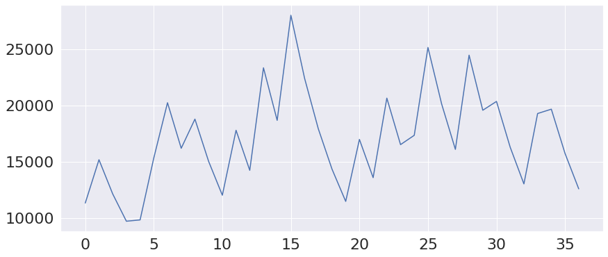

# Overview
This is part my thesis for Bsc at BME(I developed an android app to be able to use the neural network and see the correlation matrixes, graphs, etc.).
I developed two different models for the final output. One is to use historical data, to correctly predict the chances for each football teams win probability. The second to use these prediction as "y" and try to predict it using information available prior the match. It's a hard concept to understand at first glance, and my thesis is written in Hungarian, but the abstract gives an overview of my goal and the code and graphs some insight.

# Összefoglaló

A 3,5 milliárd becsült rajongóval rendelkező labdarúgás napjaink legnépszerűbb sportága. A 2018-as labdarúgó világbajnokság 3,57 milliárd nézőjével, minden idők legnézettebb labdarúgó eseménye, amit egyedül a 2012-es nyári olimpia előz meg a maga 3,6 milliárd megtekintőjével. A megtekintők növekedésével értelemszerűen a sportba fektetett pénzmennyiség is növekedett. A 2019-es bajnokok ligája alatt a csapatok között szétosztott pénzmennyiség rekord 1,3 milliárd dollárra becsülik. Ezeket a díjakat a csapatok játékos igazolásokkal, személyzetbővítéssel és jobb stadionokkal igyekeznek megszerezni, ami rengeteg pénzbefektetéssel jár.

Azonban 2002-ben az Oakland Athletics baseball csapat szinte a liga legalacsony költségvetésével megnyerte a bajnokságot. Sikerüknek a titka a sportanalitikában és a Big Data technológiákban rejlett. A sport világában a sportanalitika régóta jelen van, azonban idővel a csapatok rájöttek, hogy a Big Data technológiák helyes felhasználásával jelentős előnyre tehetnek szert. Innen már csak egy lépés volt, hogy más üzletágak is felfigyeljenek ennek fontosságára és mára a sportfogadás szoros részévé vált mind a fogadóiroda, mind a fogadók részéről. Az adatforradalomnak hála rengeteg statisztikai mutató érhető el a mérkőzni kívánó csapatokról, de ezek ismeretében sem mindig egyszerű a meccs kimenetelének a megjóslása.

A szakdolgozatom célja egy olyan adatvezérelt prediktív modell készítése, ami képes felvenni a versenyt a fogadóirodák sportanalitikai elemzéseivel. A modell labdarúgó mérkőzések végeredményét képes megjósolni, amit a felhasználók Androidos környezetben érhetnek el, más grafikonokkal és statisztikákkal együtt.

# Abstract
Soccer with its own 3.5 billion active fans is currently the most popular sport in the world. The 2018 World Cup has over 3.57 billionviews, making the event the most watched sport event of all timing, right after the 2012 Summer Olympics with over 3.6 billion views. With the increasing viewership, the amount of money invested in the sport increases to. In 2019 the Champions League had an estimated prize money of 1.3 billion U.S dollars. The clubs spend these prizes on player transfers, stuff expansion and stadium development, which involves a lot of money.

However, in 2002 the Oakland Athletics baseball team won the championship, despite having one of the lowest budgets in the league. The key to their success lays in sport analytics and Big Data technologies. Sport analytics has long been present in the world of sports, but over time, teams started to realize, that with Big Data technologies, they can make significant advantage over the other teams. From here it was just a step for other lines of businesses to notice the importance of data science and nowadays it is a crucial part of sports betting on the part of both the bookmaker and the betmakers. Thanks to the data revolution there are lots of statistics available from the teams wishing to play, but with all that predicting the outcome could still be a hard task.

The goal of my thesis is to make data-driven predictive model, that can compete with the sports analytics of the betting offices. The model is able to predict the outcome of football matches. The result will be available for the users on Android, along with other graphs and statistics.
# Felépítés

A helyes valószínűségek meghatározásához természetes jó kiindulási pont a győztes csapatra történő jóslás, amennyiben olyan kiértékelő algoritmust választunk, ami képes valószínűségszámításra. Azonban magában a győztes csapat ismerete olykor megtévesztő is lehet, mivel ilyenkor nem derül ki, hogy a csapat mennyire érdemelte meg a győzelmet. Előfordulhat ugyanis, hogy az egyik csapat dominálta a mérkőzést, de balszerencse és egy hiba következtében elveszítik a meccset. Így bár a másik csapat nyeri a mérkőzést, de ha a két csapat megismételné a fordulót, a voksunk a domináló csapatra esne. Ennek elkerülése érdekében érdemes egy olyan célváltozót felvenni, ami reális becslést ad a meccsen történtek fényében arra, hogy melyik csapat hogyan teljesített.

A fejlesztés során célváltozónak felveszek egy újmetrikát, ami a csapatok győzelmi valószínűségéthatározza meg a meccsen történtek ismeretében. Ígyvalós képet kapunk, hogy a csapatok a pályán mutatottteljesítményük alapján milyen fogadási esélyeket (Odds)érdemeltek volna. Ehhez egy új modellt készítek, amiképes valószínűségeket jósolni a mérkőző csapatokgyőzelmére és a döntetlenre, majd a modell segítségéveljóslást készítek a teljes adathalmazra, így egy olyancélváltozót kapunk, ami nem azt mutatja meg, hogymelyik csapat nyert, hanem sokkal inkább, hogy pályánnyújtott teljesítmény alapján a csapatoknak milyenfogadási esélyeket kellett volna kapniuk.

A mérkőzéseket tartalmazó adathalmazból megtartomazokat a metrikákat, amik meccs kezdete előtt isrendelkezésre álltak és kiegészítem további adatokkal,amiket a következő pontban tárgyalok. Végül a végsőmodellt erre az adathalmazra tanítom be éscélváltozónak a meccs végi statisztikákra tanított elsőmodell valószínűségjóslatait fogom felhasználni.

# Adathalmazok felépítése

# Adathalmazokhoz készített modellek

# Validálás

# Összegzés
Célom egy olyan adatvezérelt prediktív modell implementálása volt, ami képes megjósolni labdarúgó mérkőzések lehetséges kimeneteleinek valószínűségét. Az irodalomkutatás alatt megismertem, hogy az emberek milyen különböző indíttatásból kezdtek neki a sportanalitikai elemzéseiknek, milyen módon jutottak hozzá az általuk elemzett adathoz és milyen különféle technológiák segítségével érték el az általuk szerzett legjobb eredményt. 

Mindezeket figyelembe véve úgy döntöttem, hogy célom eléréséhez egy egyénileg gyűjtött adathalmazon akarom végezni az elemzést. A feladatot két részre bontottam, mivel a jóslást nem a végeredményre akartam végezni, hanem a csapatok teljesítményét legjobban leíró értékre, így az elemzés első részében ennek az értéknek a megszerzését írom le, míg a másodikban az értékre történő jóslásért felelős modell fejlesztését végeztem.   

A különböző forrásból gyűjtött adatokat letisztítottam és kiválasztottam közülük a legrészletesebb és legpontosabb értékeket tartalmazó adathalmazt, amin megvizsgáltam, hogy milyen értékek vannak a legnagyobb befolyással a végeredmény kimenetelére. Ezeket a metrikákat miután kiválasztottam, kiegyensúlyoztam az adathalmazt. Ezt követően részletesebb adatelemzést végeztem a ligában szereplő csapatokról azáltal, hogy szétbontottam az adathalmazt az egyes csapatok meccseit tartalmazó adathalmazokra, majd formaszámítást és a csapatokról gyűjtött mutatókat összegyűjtöttem a mobilalkalmazás számára. 

Több gépi tanuló modellt is kipróbáltam, amik közül kiválasztottam a legjobban teljesítőt. Részletesen elemeztem a modell teljesítményét a témában született egyéb munkákkal, megvizsgáltam a modell által jósolt értékek eloszlását és azt, hogy modellemmel lehet-e profitot realizálni.

Végül készítettem egy mobilalkalmazást, amiben a felhasználók átfogó képet kaphatnak az elemzett csapatok múltban elért teljesítményeiről és jelenlegi helyzetükről, valamint használhatják a prediktív modellt az elkövetkezendő meccsre történő valószínűségjóslására, amit összevethetnek a fogadóiroda által megadott valószínűségekkel és megköthetnek a legkedvezőbb fogadást.

# Köszönetnyilvánítás

Szeretném megköszönni Dr. Toka Lászlónak, hogy a félév során konzultációs tevékenységével segítette munkámat, hasznos tanácsokkal és segédanyagokkal látott el, amikor akadályba ütköztem, ezzel hozzájárulva, hogy elkészíthessem szakdolgozatomat. 
